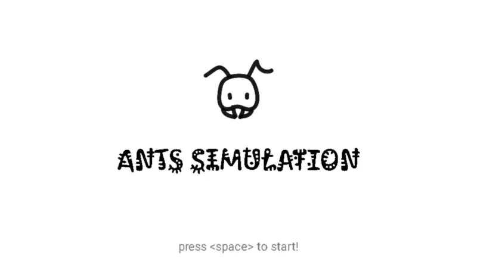

# Ants Simulator 
A thread based application simulating food foraging and pheromone communication in ant life.

🔗 | [Project Statment](docs/project3_threads.pdf)  <br>
🔗 | [Installation](docs/install.md)<br>

<br>
---
## Running

Compile  

```bash
make
```

Compile & Run

```bash
make run
```


## TODO
- [x] Makefile
- [x] Threads
- [x] Food
- [x] Mutex
- [x] Steroids
- [x] Improve Structure
