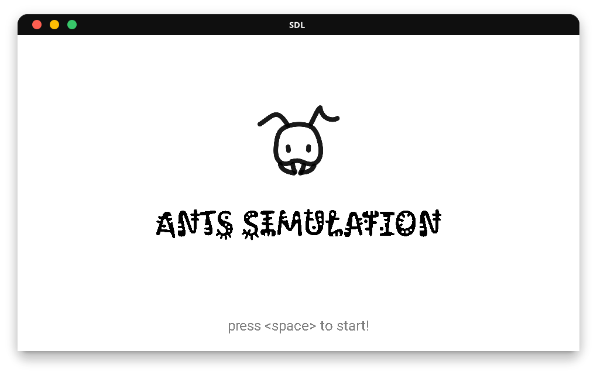

# Ants Simulation
A thread based application to learn how to work with POSIX threads under linux.

🔗 | [Project Statment](docs/project3_threads.pdf)  <br>
🔗 | [Installation](docs/install.md)<br>
<br>
<br>
---
## Running
After insalling required libraries see [Installion Guide](docs/install.md) <br>
Compile 
```bash
make
```
Compile & Run
```bash
make run
```


## TODO
- [x] Makefile
- [x] Threads
- [x] Food
- [x] Mutex
- [x] Steroids
- [x] Improve Structure
